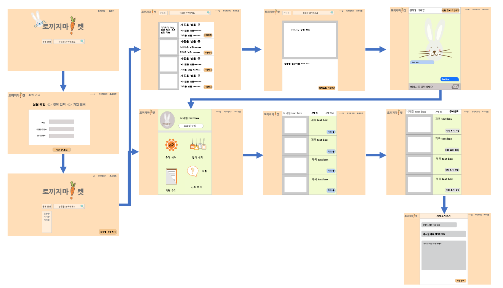
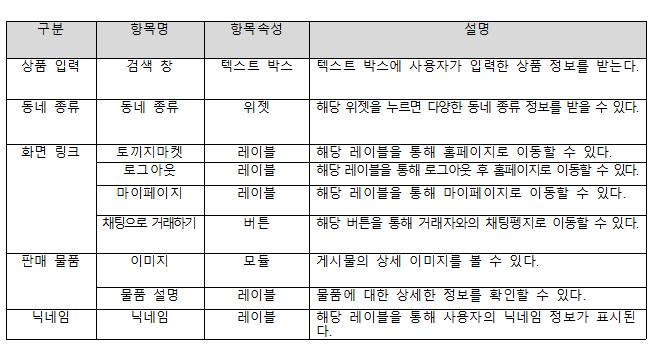
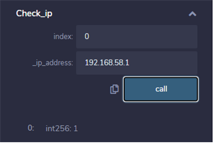

# 블록체인 기술을 활용한 중고거래 사기 방지 시스템
## fraud prevention platform using blockchain technology

서론
----

### 개발 과제의 개요

#### 개발 과제 요약

`본 플랫폼은 블록체인 기술을 활용한 중고거래 사기 방지 시스템을 구현한다. 중고거래 시스템에 블록체인 기술을 활용함으로써 중앙 관리자 없이 사용자 간의 거래가 이루어진다. 이때, 중간 관리자 없이 거래 계약을 하는 스마트 컨트랙트를 진행함으로써 중간 관리자에 의한 사기, 위조를 방지한다. 거래를 원하는 사용자는 상대방 신원 정보의 유효성 여부를 조회할 수 있다. 결과에 따라 사용자는 거래 진행 여부를 결정할 수 있다. 또한, 회원가입 시 등록하는 신원 정보를 블록체인에 저장하여 신원 위변조 등과 같은 중고거래 사기 상황을 방지할 수 있다. 이와 같이, 해당 플랫폼을 통해 온라인 중고거래의 신뢰성을 높여 활발한 중고거래가 이루어지도록 할 것이다.`

#### 개발 과제의 배경

`최근, 다양한 애플리케이션과 웹페이지를 통해 중고거래 시장이 활발해졌다. 특히 ‘당근 마켓’과 같은 앱의 등장으로 누구나 손쉽게 중고거래가 가능하게 되면서 이용자의 수가 증가한 것으로 보인다. 하지만, 이런 플랫폼을 악용하는 중고거래 사기 또한 늘고 있다. 판매글을 올려 입금받은 후 물품을 보내지 않거나 사진과 다른 물품을 보내는 등, 사기의 종류가 다양해지고 그 수법도 점차 교묘해져 사용자의 불안을 사고 있다. 현재 중고거래 플랫폼에서는 높은 수수료를 지불하여 안전거래 시스템을 이용하며, 그렇지 않은 경우 사기 범죄의 위험에 노출되는 수밖에 없다. 이와 같은 현상을 막고자 본 프로젝트는 블록체인의 신원 인증 기술을 이용하여 좀 더 신뢰성 있는 중고거래 방지 플랫폼을 만들고자 한다.`

`요즘같이 코로나로 인해 사람 간에 신체 접촉이 꺼려지는 시기에는 직접 만나서 중고거래를 하기보다 택배를 통한 거래가 활발히 일어날 것이라 예상된다. 택배 거래를 이용하는 경우, 상품을 직접 보지 못하기 때문에 판매자의 사진에 의존하여 상품을 구매하고 입금을 진행한다. 따라서 직거래에 비해 중고거래 사기 사건이 발생할 확률이 매우 높다. 이러한 시기로 보아, 본 프로젝트에서 개발하는 플랫폼을 통해 중고거래 사기의 급증을 방지할 수 있을 것으로 예상된다.`

#### 개발 과제의 목표 및 내용

`플랫폼을 이용하기 위해 사용자는 웹페이지 내에서 개인 정보를 입력하여 회원가입을 수행한다. 첫 번째 단계로, 신원 인증을 진행한다. 이름과 주민등록번호의 입력을 통해 가입 가능 여부를 조회 받는다. 조회에 성공한 사용자만이 가입 가능하며 접속한 IP 주소를 등록한 후 정보 입력 단계로 이동한다. 사용자 ID, Password, 주소, E-mail 주소 등을 입력하여 회원가입 절차를 마친다.`

`중고거래 판매와 구매 과정이 이루어진다. 로그인된 사용자가 웹페이지 내에서 판매를 원하는 상품을 업로드하기 위해 게시글을 작성한다. 구매를 원하는 사용자 또한, 로그인되어 있어야 하며 검색 기능을 통해 상품을 검색할 수 있다. 데이터베이스에서는 검색된 상품을 전달하고, 이 결과는 화면에 표시된다. `

`판매자와 구매자는 채팅 기능을 통해 구매 절차를 진행하며 판매자는 거래가 완료된 상품의 판매 완료 버튼을 클릭하여 시스템에 알린다. `

`거래가 완료되면, 로그인된 회원 정보로 각각 판매내역이 저장된다. 마이페이지에서 판매내역목록 확인이 가능하다.`

`사용자는 거래를 위해 채팅을 진행한 상대방에 대한 후기를 작성할 수 있다. 또한, 한 사용자에 대해 작성된 후기 목록을 확인할 수 있다.`

`사기 사건이 발생한 경우, 신고하기 기능을 제공한다. 먼저 신고 매뉴얼 절차대로 신고를 진행한다. 경찰과 같은 공공기관에서는 사기 신고를 접수 받으면 피신고자의 신원을 요구할 수 있다. 중앙 관리자가 없는 블록체인 기술을 활용하였기 때문에, 사기 신고 접수시 경찰 인증을 완료한 사용자에게 블록체인이 피신고자의 신원 정보를 전달할 수 있도록 구현한다.`

`해당 플랫폼의 구현을 통해 기존의 안전거래 시스템이 사용된 거래 사이트에 비해 사용자가 부담하는 수수료를 절감하고, 사기 방지를 포함한 거래에 대한 안정성을 확보하는 것을 목표로 한다.`

### 관련 기술의 현황

#### 관련 기술의 현황 및 분석(State of art)

-   전 세계적인 기술현황

`블록체인이란, 분산 데이터 베이스의 형태로 거래 정보를 기록한, ‘블록’이라고 하는 소규모의 데이터들을 중앙 서버 한 곳에 저장하는 것이 아니라 블록체인 네트워크에 연결된 여러 컴퓨터에 저장, 보관하는 기술이다. 현재 국내 블록체인 대표적인 기업으로는 코인플러그, 블로코, 코인원 등이 있으며, 비트코인 등 가상화폐 거래를 지원하는 거래소와 블록체인 기반 응용 서비스를 제공하는 si 기업으로 구분한다 최근 국내의 대표적인 블록체인 전문 거래소인 코인원은 세계 3위 규모의 이더리움 거래소로 성장하는 등 가상 화폐 투자 및 거래소는 활발하나, 국내 블록체인 응용 서비스는 아직까지는 미비하다. 하지만 각 기업들은 블록체인 기술 분석 및 개발을 통해 다양한 응용 서비스를 준비하고 있다. 국내에서는 아직까지 블록체인 응용 서비스를 준비 중에 있지만, 국외에서는 이미 기존 블록체인의 문제점들을 해결하고 보다 발전된 블록체인 기술을 적용 중에 있다. 블록체인의 핵심 기술의 현황은 다음과 같다. `

`▶ P2P 네트워크: P2P란 peer-to-peer의 약자로, 비교적 소수의 서버에 집중하기보다는 망 구성에 참여하는 기계들의 계산과 대역폭 성능에 의존하여 구성되는 통신망이다. 간단하게, 중앙 서버없이 컴퓨터끼리 각각 서버와 클라이언트가 되어, 서로 사이를 연결하여 데이터를 주고받는 양방향 파일 전송 시스템이다. 서버가 없고, 각 노드들이 트래픽과 자원을 할당하여 부하를 분산시키고, 높은 확장성을 가진다는 장점이 있다. 블록체인은 소규모의 데이터들이 p2p방식을 기반으로 생성된 체인 형태의 연결고리 기반 분산 데이터 저장환경에 저장된다.`

`▶ 스마트 컨트랙트: 스마트 컨트랙트(Smart Contract)란, 서면으로 이루어지던 계약을 코드로 구현하고 특정 조건이 충족되었을 때 해당 계약이 이행되도록 하는 스크립트이다. 스마트 컨트랙트는 기존에 사용하던 프로그래밍 언어로는 만들 수 없고 solidity, vyper와 같은 스마트 컨트랙트를 작성하는 전용 언어로 정의한다. 이 후, 컴파일러를 통해 바이트 코드로 변환하여 블록체인 상에 배포하게 된다. 스마트 컨트랙트를 활용하면 특정 조건이 충족되지 않으면 계약이 실행되지 않기 때문에 두 거래자가 신뢰하지 않더라도 계약을 체결할 수 있고, 중개인 없이도 이행할 수 있다. `

`▶ 분산 원장 기술: 분산 원장 기술(DLT : Distributed Ledger Technology)은 중앙원장 기술과 반대로, 중앙 서버나 관리자의 제어 없이 분산화된 네트워크의 각 노드들이 데이터 베이스를 공유하고 반복하여 동기화하는 기술이다. 블록체인에서는, 분산 원장 기술의 틀 속에서 구성된다. 블록체인이 하나의 원장 역할을 하면서 중앙 관리자 없이 분산되어 있는 노드들에게 원장이 복제, 공유되어 모두가 원본을 관리할 수 있다. 분산된 환경에서 노드들끼리 데이터를 주고받는 과정을 블록에 담아 전파하면 노드들의 합의를 통해 검증하여 체인으로 연결된다. `

`▶ 암호화 기술: 암호화 기술은 중요한 정보를 읽기 어려운 값으로 변환하여 제 3자가 볼 수 없도록 하는 기술이다. 이를 통해 데이터의 기밀성, 데이터 무결성, 인증 및 부인 방지 등의 기능을 제공할 수 있다. 블록체인은 데이터 보안을 위해 암호화 기술에 크게 의존한다.`

-   특허조사

`등록 특허 명칭: 블록체인 기반의 게임 난이도 조절을 위해 작업 즉명을 이용한 분산 원장 장치 및 분산 원장 방법`\
`출원 번호(일자) 1020180045114(2018.4.18.) 출원인: 주식회사 미탭스 플러스`\
` : 상기 난이도 정보 관리 계정 및 상기 복수의 스마트 계약 계정을 이용하여, 복수의 게임 애플리케이션에 대해 상기 난이도 정보를 공유하여 상기 복수의 게임 애플리케이션의 게임 난이도를 통합적으로 조절하며, 상기 특정 사용자가 특정 게임 애플리케이션에 대해 사용시간, 레벨 상승 및 퀘스트 해결 중 적어도 하나를 포함하는 기설정된 조건을 만족하면 상기 블록체인에 새롭게 생성된 블록을 작업 증명하도록 구성되는 것을 특징으로 하는, 블록체인 기반의 게임 난이도 조절을 위해 작업 증명을 이용한 분산 원장 방법. `

`등록 특허 명칭: 접근통제형 장비를 위한 생체인증 로그 데이터의 블록체인 공유 기반의 액세스 보안 관리 시스템 `\
`출원 번호(일자) 10020180037774(2018.03.30.) 출원인 : 옥타코 주식회사`\
` : 엑세스 시도에 대응하여 생체 센서를 통해 접근자 생체정보를 획득하고 상기 접근자 생체정보를 미리 등록된 레퍼런스 생체정보와 대비하는 생체인증에 성공하는 경우에 기기 엑세스를 허용 처리하며 상기 엑세스 시도에 관련하여 장비식별 정보, 접근 위치 정보, 접근 시간 정보를 포함하는 생체인증 로그 데이터를 생성하며 블록체인 처리를 통하여 상기 생체인증 로그 데이터를 실시간으로 공유하는 블록체인 처리를 통해 복수의 접근통제형 장비. `

`등록 특허 명칭: 블록체인 기반으로 환자 정보를 저장하는 병 의원 보안시스템`\
`출원 번호(일자) 1020180033593(20118.03.23) 출원인 : 주식회사 아이라이즈`\
` : 환자의 전자 차트 정보를 해시값으로 가공하여 정보 기록을 위한 트랜잭션을 생성하고 생성된 트랜잭션을 상기 블록체인 보유 서버들에게 전달하여 승인하도록 수성된, 블록체인 기반으로 환자 정보를 저장하는 병의원 보안시스템`

`등록 특허 명칭: 입출금 내역 비교를 통한 실명거래 검증 시스템 및 방법`\
`출원번호(일자) 1020180027748(2018.03.09.) 출원인 : 주식회사 쿠콘`\
` : 입금 신고 정보, 입금 내역 정보 및 출금 내역 정보를 비교하여 사용자 계좌로부터 거래소 계좌로의 입금 내역의 정당성을 검증하고 검증 결과를 상기 거래소 서버로 전송하는 단계를 포함하는 입출금 내역 비교를 통한 실명 거래 검증 방법. `

-   특허 전략 분석

`스마트 컨트랙트의 구성 및 내용과 관계된 기술적 특징들을 제안해야 한다.`

`트랙잭션의 구성 및 내용의 비즈니스, 서비스 모델에 관한 고유한 기술적 특징을 제안해야 한다. 그 내용을 구체화하지 않고, 중앙 데이터베이스를 블록체인으로만 대체한 경우는 특허 확보가 어렵다.`

`타임 스탬프 생성 방식 등 트랙잭션 외 블록의 구조와 관계된 기술적 특징을 제안해야 한다.`

`운용 주체 등 블록체인의 운용 방식과 관계된 기술적 특징, 서브 블록, 전자 서명 방식 등과 같은 블록체인의 구조를 제안해야 한다. `

`블록체인의 데이터 기록, 조회를 위한 API에 부가된 기능에 관한 기술적 특징을 제안해야 한다. `

-   기술 로드맵

\
`비트코인은 블록체인 기술이 처음으로 실용화된 사례이다. 이 후, 비트코인의 소스 코드를 일부 변형한 네임코인, 메타 코인 등 몇 가지 새로운 코인들이 출현했으나 기존 블록체인 기술의 부분적 변형에 불과했다. 2015년 이더리움 서비스가 시작되었고, 이더리움은 블록체인 기술을 이용하여 스마트 계약을 실현하였다. 따라서 비트코인을 ‘블록체인 1.0’, 이더리움을 ‘블록체인 2.0’이라고 부른다. 2017년에서 2018년 사이에, 에이다 등 다양한 암호화폐가 출현했다.`

#### 시장상황에 대한 분석

-   경쟁제품 조사 비교

`대표적인 모바일 중고거래 앱인 당근마켓에는 사용자의 거래 매너를 의미하는 ‘온도’가 존재한다. 그러나 사기를 방지하는 기능과는 달리 약속 파토, 연락 매너 등의 애플리케이션 사용 예절의 전반적인 내용을 평가하는 것이라 사기 시도를 방지 하는 것에 있어서는 신뢰도가 낮고, 추후 이를 처리하는 것에 있어서는 도움이 되지 못한다. `

`2000년대부터 온라인 최대규모 사이트인 중고나라는 안전거래 기능을 지원한다. 사기가 일어남을 방지하기 위하여 신뢰할 수 있는 제 3자를 고용하는 것이다. 사기를 높은 확률로 방지할 수 있지만 잘 사용되지 않는 이유는 높은 수수료 때문이다. 계좌 간편결제/실시간 계좌이체는 1.65%, 무통장입금은 1%로 상당히 높은 수치이다. 중고거래의 특성상 가지고 있는 물건을 팔아 현금을 마련하기 위한 사용자들이 주 사용자이기 때문에 수수료가 높은 사기 방지 정책은 좋게 평가받기 힘들다. `

`에브리타임, 블라인드 등 신원 확인 후 가입이 가능한 일반 커뮤니티에서도 중고거래가 일어난다. 어느정도 확인된 신원을 가진 사람끼리의 거래이므로 사기확률은 낮지만 완벽한 사기 방지라고 보기는 어렵다. 또한, 중고거래를 겨냥한 플랫폼이 아니기 때문에 거래를 원하는 사용자들이 적어 시장이 좁다는 문제점이 있다.`

-   마케팅 전략 제시

`블록체인을 이용하면 사용할 수 있는 대표적인 이점이 바로 정보 보안성 및 안정성이다. 이를 이용하면 가입한 사용자들의 신원정보에 대해서 철저한 보안이 가능하고, 블록에 영구히 정보가 남기 때문에 언제든지 범죄자의 신원정보를 조회할 수 있다. 따라서, 범죄를 저지르더라도 사후 조치에 빠르게 대응할 수 있다. `

`블록체인의 대표적인 특징으로는 탈중앙화가 있다. 서비스를 개시할 때 블록에 한번 올리는 비용을 제외하고는 사용자들이 새로운 정보를 나눌 때에는 수수료가 현저히 낮다. 본 프로젝트에서 사용된 이더리움의 평균 가스비용 0.4gwei는 0.003달러, 한화로는 3.34원으로 매우 경제적임을 알 수 있다.`

`본 프로젝트에서는 경찰 인증을 하면 얻을 수 있는 경찰 계정이 존재하여, 사기 신고가 접수되면 신속하게 사기꾼의 신원을 확인할 수 있다. 중고거래 사기가 경범죄에 해당하고 사건접수 처리가 많아 번거로운 것을 고려하면 경찰에게 계정을 부여하여 사기꾼 신상 정보를 조회하는 방식은 사건접수 및 처리에 높은 효율성을 가져다줄 것이다.`

`사기거래 방지 플랫폼을 내세우는 토끼지마켓은 근본적으로 사기꾼들이 접근하길 꺼려할 것을 쉽게 예상할 수 있다. 이로 인해 안전한 중고거래를 원하는 사용자들은 더욱 사기꾼이 적은 시장에서 거래를 시도할 수 있으며 더 많은 보통 사용자들이 유입되는 선순환을 예상할 수 있다.`

### 개발과제의 기대효과

#### 기술적 기대효과

` 블록체인 기술은 신뢰할 수 있는 제3자인 중개인이 없는 상황에서도 다수의 개인 간 합의 과정을 통해 데이터를 검증하고, 검증된 내용은 블록체인 구조의 장부에 저장하는 방식으로 중개인의 역할을 대체하여 신뢰도 높은 거래를 가능하게 한다.`

` 블록체인을 기반으로 한 플랫폼은 구매자와 판매자를 매칭하고 거래를 촉진하던 기존 플랫폼의 역할과 동일한 기능을 수행하는 노드 네트워크로 대체한다. 이로 인해 탈중앙화가 가능해져 중앙기관의 구축 및 유지비용을 최소화할 수 있으며, 다수가 동일한 원장을 보유하고 비교하기 때문에 보다 높은 보안성을 기대할 수 있다.`

` 따라서 해당 플랫폼은 블록체인 기술을 접목하여 보안, 안정성을 획득한 탈중앙화 중고거래 플랫폼의 구축이 가능하다.`

#### 경제적, 사회적 기대 및 파급효과

` 최근 국내 온라인 중고거래 시장의 규모는 약 20조 원으로 급성장했다. 그러나, 중고거래 시장에서는 사기 사건을 포함한 여러 문제들이 지속적으로 발생하고 있다. 기존 플랫폼에서 적용 중인 안전거래 시스템은 사기 문제를 어느 정도 해소할 수 있지만, 높은 수수료율로 인해 많은 거래에서 적용되고 있지 않다. 해당 플랫폼은 낮은 수수료율로 현재의 안전거래 시스템을 구현하여 사용자들의 접근성을 높인다.`

` 중간 관리자 없이 거래 계약을 하는 스마트 컨트랙트를 진행함으로써 중간 관리자에 의한 사기, 위조를 방지한다. 또한, 회원가입 시 등록하는 신원 정보를 블록체인에 저장하여 신원 위변조 등과 같은 중고거래 사기 상황을 방지할 수 있다.`

` 중고거래 사기는 개인의 피해로 피해 금액을 돌려받기 어렵다는 점에서 본 플랫폼이 개발된다면 사기 피해 금액이 줄어들 것으로 기대된다.`

#### 구성원 및 추진체계

-   김민혜: 팀장, 블록체인 구현, 웹페이지 구성 디자인

`  - 웹페이지 프로토타입 제작 (Adobe XD 사용) `\
`  - 스마트 컨트랙트 작성: solidity 언어 사용하여 계약서 작성(이더리움 리믹스 사용) `\
`  - 스마트 컨트랙트 배포: 테스트넷 + 메인넷 배포(TRUFFLE 사용) `\
`  - web3.js 사용하여 웹에서 컨트랙트 보여주기`

-   박지원 : 블록체인 구현, 회의록 작성, 스케줄표 작성

`  - 스마트 컨트랙트 작성: solidity 언어 사용하여 계약서 작성(이더리움 리믹스 사용) `\
`  - 스마트 컨트랙트 배포: 테스트넷 + 메인넷 배포(TRUFFLE 사용) `\
`  - web3.js 사용하여 웹에서 컨트랙트 보여주기`

-   강진호 : DB 구축

`  - CRUD 기능 구현 (MongoDB, ODM(mongoose) 사용)`\
`  - DB에 저장되는 항목 정리 `\
`  (아이디/비밀번호 - 닉네임 - 주소 - 판매 물품(동네별) - 판매/구매 내역 - 거래 후기)`

-   이희진 : 프론트앤드 구축

`  - 웹페이지 구현 (html, css(bootstrap), javascript(JQuery) 사용)`\

-   장호진 : 서버구축, 지원비 관리

`  - MVC 패턴을 이용한 REST API 개발. (nodejs, npm, Express.js 사용)`

-   공통 역할 : UML다이어그램 작성, 아이디어 회의, 주간보고서 작성, 주간
    보고서 발표

설계
----

### 사용자 요구사항

### 사용자 요구사항 만족을 위한 기능 정의

#### 제품의 요구사항

`◇ 사용자 정보를 입력받아 신원 정보를 블록체인에 저장하고 회원가입을 한다. `\
`◇ 사용자는 로그인 시 블록체인에 있는 사용자의 ip주소를 확인 후 일치하면 로그인한다. `\
`◇ 사용자는 동네별로 구매하고 싶은 물품을 보거나 직접 판매 글을 작성한다. `\
`◇ 사용자는 거래하기 기능을 통해 판매자와 거래를 진행한다. `\
`◇ 판매자와 구매자 사이의 채팅 기능을 구현한다. `\
`◇ 사용자는 거래하려는 사람의 ip주소와 상대의 위치가 일치하는지 확인할 수 있다. `\
`◇ 사용자는 판매 내역, 구매 내역, 거래 후기와 채팅방을 마이페이지에서 확인할 수 있다. `\
`◇ 사용자는 거래 후 거래 후기 작성 페이지로 가서 중고거래 후기를 작성할 수 있다.`

#### 회원가입

-   신원 확인을 위한 정보 입력

`이름, 주민등록번호 등의 신원 확인을 위한 정보를 웹페이지에 입력한다. 입력된 정보가 블록체인의 웹서버와 연결되어 Smart Contract에서 작성된 함수를 불러 블록체인에 block의 형태로 올린다.`

-   회원가입을 위한 정보 입력

`아이디, 비밀번호, 핸드폰 번호, 생년월일, 성별 등의 회원가입을 위한 정보를 웹페이지로부터 입력받고 서버에 보낸 후 데이터베이스에 저장한다.`

#### 로그인

-   로그인 하기

`로그인 페이지에서 사용자가 아이디, 비밀번호를 입력받는다. 데이터베이스에 저장되어있는 정보와 일치할 시 로그인, 불일치 시 다시 입력을 받는다.`

-   로그인 할 때, 신원 인증

`로그인 시, 사용자의 ip 주소를 받아오고 블록체인에 있는 해당 사용자의 ip 주소와 비교한다. 일치하지 않는다면 다시 한번 신원 인증 정보를 받도록 한다.`

-   로그인 후

`로그인 후 홈페이지 메인 화면을 띄운다.`

#### 판매

-   판매 물품 보여주는 페이지

`동네별로 판매하는 물품을 데이터베이스에서 웹페이지로 불러온다. 페이지에는 판매자가 작성한 게시물의 제목 및 판매자의 닉네임, 물품의 가격과 물품의 사진이 보여진다.`

-   판매 물품의 상세 설명 페이지

`판매 물품 보여주는 페이지에서 사용자가 구매하고 싶은 물품을 클릭하면 보여진다. 데이터베이스에 저장된 판매 물품에 대한 설명을 서버가 불러와 웹페이지에 띄운다.`

-   판매 글 작성하기

`판매글 작성하기 버튼을 클릭하여 사용자는 판매할 물품에 대한 게시물을 작성할 수 있다. 제목, 판매 내용, 물품에 대한 사진, 물품 가격, 동네 설정을 웹페이지에서 입력하고 작성 완료 버튼 클릭 시, 서버가 데이터베이스로 정보를 넘겨 저장한다.`

#### 구매(거래하기)

-   구매하기

`사용자는 판매 페이지에서 원하는 물품에 대한 ‘거래하기’ 기능을 통해 판매자와 거래를 진행한다. 거래하기 버튼 클릭 시, 판매자와 채팅을 할 수 있다. (5번의 기능으로 넘어간다.)`

#### 채팅 기능

-   채팅 기능

`판매자와 구매자 사이의 채팅 기능을 구현한다. 사용자가 판매 물품 설명 페이지나 마이페이지에서 채팅방으로 접속하면, 판매자와 구매자의 정보를 데이터베이스에 가져와 채팅방을 만들고 실시간 채팅을 할 수 있다.`\

#### 신원 정보 확인

-   신원 인증 확인하기 기능

`사용자는 거래를 원하는 상대 신원의 신뢰성을 확보하기 위해, 신원 정보 확인하기 버튼을 클릭한다. 서버는 현재 사용자의 ip 주소의 위치와 현재 사용자의 위치가 일치하는지 확인한다. 확인 후 결과를 웹페이지에 띄운다.`\

#### 마이페이지

-   판매 내역 확인하기

`사용자가 판매 중인 물품이 거래 중인지 거래가 완료되었는지 확인할 수 있다. 데이터베이스에 저장되어있는 판매 정보를 가져온다.`\
`판매 중: 판매 글을 작성하면 데이터베이스에 정보가 올라가고 해당 물품을 판매 중 카테고리에 올라가게 한다. 거래 완료 버튼을 누르면 판매를 마치게 되며, 판매 데이터베이스에서 해당 물품을 삭제하고 구매 완료 카테고리에 올라가도록 한다.`\
`판매 완료: 판매가 완료된 물품을 데이터베이스에서 가져와 웹페이지에 띄운다.`

-   구매 내역

`사용자가 구매한 완료된 물품의 정보와 구매 중인 물품 정보를 확인할 수 있도록 데이터베이스에서 정보를 가져온다. `\
`구매 중: 거래하기 버튼을 눌러서 물품 거래 시, 해당 물품을 구매 중 카테고리로 가져온다.`\
`구매 완료: 판매자가 거래 완료 버튼을 눌러서 판매를 완료하면, 구매 중의 물품이 구매 완료 카테고리로 들어오고 거래 후기 버튼을 눌러서 거래 후기 작성이 가능하도록 구현한다. (8번 거래 후기 기능)`

-   거래 후기

`해당 사용자가 다른 사람으로부터 받은 후기를 데이터베이스에서 불러와 보여준다.`

-   채팅방 보여주기

`현재 사용자가 채팅하고 채팅방을 보여준다. `

#### 거래 후기 작성

`거래 후기 작성 버튼을 클릭하여 거래 후기 작성 페이지로 간다. 작성된 거래 후기를 데이터베이스에 저장한다.`

#### 신고하기

-   신고 매뉴얼 알려주기

`사용자가 신고하고자하는 User를 선택하면 사기 범죄 신고 매뉴얼을 알려준다.`

-   공공기관에 신고자의 정보를 제공하기

`경찰과 같은 공공기관에서 사기 신고를 접수를 받으면, 해당 신원을 요구 할 수 있다. 블록체인을 활용하여 중앙 관리자가 없으므로, 사기 신고 접수시 블록체인에서 경찰 측으로 사기 신고 신원자의 정보를 전달하도록 구현한다.`

### 기능 구현을 위한 세부기술 선택사항 (디자인)

-   블록 체인

`Ethereum remix: 브라우저에서 스마트 컨트랙트 개발 및 컴파일, 테스트 넷에 배포를 할 수 있는 통합 개발 환경(IDE)이다. 본 연구에서는 해당 개발 환경을 통해 블록 체인의 기능을 테스트해보고 테스트 넷에 배포할 수 있다. `\
`Web3.js: 자바스크립트(java script)를 기반으로 블록 체인의 DApp이나 사용자에게 블록 체인 서비스를 제공하기 위해 사용되는 모듈이다. 해당 모듈을 통해 서버와 블록 체인을 연결할 수 있다. `

-   프론트 앤드

`EJS: html에서 태그를 이용한 것처럼 script의 내용을 삽입할 수 있다. 이를 통해 페이지 동적 프로그래밍이 가능해 진다. `\
`bootstrap: 웹 디자인 시, 다양한 css 기능을 해주는 라이브러리이다. UI 디자인 개선을 위해 사용한다. `

-   백 앤드

`mongoDB: c++로 작성된 오픈소스 문서지향적(Document-Oriented) Cross-platform 데이터베이스이며 NoSQL 데이터이다. 기존의 RDBMS의 관계 DB가 아니며 고정된 스키마가 존재하지 않는다. MongoDB Atlas를 이용하여 해당 데이터를 Cloude에 올려 연동한다. `\
`Node.js: 확장성이 있는 네트워크 애플리케이션 개발에 사용되는 소프트웨어 플랫폼으로 Non-blocking I/O와 단일 스레드 이벤트 루프를 통해 높은 처리 성능을 가지고 있다. npm 패키지를 통해 내장된 다양한 라이브러리로 서버의 동작을 보다 쉽게 구현할 수 있다.  `

-   배포

`HEROKU(헤로쿠) 서버: 헤로쿠는 어플리케이션을 빌드해주는 클라우드 플랫폼으로 보다 빠르게 URL을 만들어 준다. 개발자가 어플리케이션을 배포를 가능하게 해주는 서비스이다. `\
`Google Cloud Storage: 해당 플랫폼을 통해 사진 파일 업로드 시, 저장해야할 파일을 cloud에 저장하여 사용자에게 보여줄 수 있다.`

### 유스케이스

#### UML 다이어그램/시나리오

-   전체 시스템

-   회원가입

-   로그인

-   구매

-   판매/물건 업로드

-   상대방 정보 확인

-   채팅하기

-   신고하기

### UI 설계

#### UI 정의

1.  UI Flow

-   중고 물품을 구매하는 사용자의 UI Flow

-   중고 물품을 판매하는 사용자의 UI Flow

-   마이페이지 UI Flow

-   신고하기 UI Flow

1.  화면 목록

1.  화면 흐름도

-   중고 물품을 구매하는 사용자의 화면 흐름도

-   중고 물품을 판매하는 사용자의 화면 흐름도

-   마이페이지 화면 흐름도

-   신고하기 화면 흐름도

1.  화면 정의

-   홈 화면

-   로그인 후 홈 화면

-   회원가입
-   신원 확인

-   정보 입력

-   가입완료

-   판매 페이지

-   판매 물품 설명 페이지

-   채팅방

-   마이페이지

-   구매 내역 – 구매 중

-   구매 내역 – 구매 완료

-   판매 내역 – 판매 중

-   판매 내역 – 판매 완료

-   거래 후기

-   채팅방 보여주기

-   판매 작성 페이지

-   거래 후기 작성 페이지

-   프로필 수정 페이지

-   신고하기 페이지

### 데이터베이스 설계

-   DBMS

-   데이터 모형
-   데이터베이스 개발 및 배포

`StarUML  : 논리 데이터 모델링 설계 도구  `\
`MongoAtlas : MongoDB Cloud Hosting `\
`Mongoose : JavaScript 기반 MongoDB 연계 모듈 `

◇ 테이블 및 칼럼

1.  user

1.  history

1.  post

1.  file

1.  comments

1.  chats

1.  counters

1.  review

### 소프트웨어 설계

#### 블록체인 시스템 설계

1.  블록체인 개발환경

`testrpc  : 블록체인 테스트 네트워크  `\
`solidity : 스마트 컨트랙트 작성 언어 `

이더리움 리믹스 : 스마트 컨트랙트 작성, 컴파일, 배포 IDE

1.  블록체인 설계도

-   블록체인 서버 접속

:   블록체인에 스마트 컨트랙트를 올리기 위해서는 블록체인
    네트워크에 접속해야한다. 실제 이더리움 메인 네트워크에 접속하여
    테스트 하려면 실제 이더가 필요하기 때문에 테스트
    네트워크를 이용한다. 본 프로젝트에서 사용한 testrpc는
    이더리움 시뮬레이터이다. 실제 이더리움과 동일한 블록체인 구조를
    가지고 있지만, 실제 이더가 필요하지 않고 가상 환경에서 제한없이
    테스트 할 수 있다.

-   스마트 컨트랙트 작성

:   스마트 컨트랙트를 작성한다. 본 프로젝트에서는 솔리디티 언어로
    이더리움 리믹스를 사용하여 개발한다.이더리움 리믹스는 스마트
    컨트랙트 작성 언어인 솔리디티 개발을 위한 브라우저 기반의 IDE이다.
    별도의 설치 없이 웹으로 접속할 수 있다. 즉, 브라우저 상에서 테스트
    환경을 제공하고 작성한 스마트 컨트랙트를 컴파일하여 바이트
    코드로 변환해준다. 뿐만 아니라, WEB3 PROVIDER를 통해 앞서 접속한
    블록체인 테스트넷과 연결해 스마트 컨트랙트를 배포, 테스트할 수
    있게 해준다.

-   스마트 컨트랙트 컴파일

:   스마트 컨트랙트를 컴파일하여 바이트 코드로 변환한다.

-   스마트 컨트랙트 배포

:   스마트 컨트랙트를 배포하여 배포된 주소값을 얻는다.

-   웹 서버와 연결

앞서 얻은 블록체인 계정, 바이트 코드, 주소 값을 통해 웹 서버에서 스마트
컨트랙트를 불러온다. 이 때, node js에서 제공하는 html 환경에서
블록체인의 스마트 컨트랙트를 불러올 수 있도록 하는 js 라이브러리인
web3js를 사용한다.

-   프론트엔드와 연결

#### 전체적인 시스템 설계

:   게시판 모듈, 채팅 모듈, 사용자 모듈, 사용자가의 마이페이지 모듈,
    신고하기 모듈이 있으며 각 모듈의 기능은 위의 그림과 같다. 사용자가
    서버로 해당 모듈에 대한 요청을 보내면 서버는 CRUD 기능을 수행하여
    DB에 생성, 삭제, 업데이트, 읽기 등의 기능을 수행한다. 이때, 사진
    파일의 경우 GCP에 Upload한다. 블록 체인에 CRUD 기능에 대한 요청을
    받을 시, Web3.js를 통해 Smart Contract를 호출하여 블록 체인
    서버와 연동한다.

결과 및 평가
------------

### 완료 작품의 소개

#### 프로토타입 사진 혹은 작동 장면

가. SW 실행 방법

`◇ 블록체인 실행 방법`

` 1) 블록체인 서버 접속 `\
` 본 프로젝트에서는 테스트넷 testrpc 사용`

` 2) 작성한 스마트 컨트랙트 컴파일 `\
` 본 프로젝트에서는 이더리움 리믹스 사용 `\
` 이 때, 스마트 컨트랙틔 ABI 코드 생성. 추후 웹 서버에서 스마트 컨트랙트 호출할 때 사용`

` 3) 블록체인 서버와 연결 후 배포`\
` 이 때, 사용한 이더계정과 배포한 스마트 컨트랙트의 주소를 추후 웹 서버에서 스마트 컨트랙트 호출할 때 사용`

`◇ 경찰 `\
`경찰로 인증된 회원만 해당 페이지에 접속할 수 있습니다. `\
`  `\
`• 사기 접수된 사용자의 신원 정보 조회 과정 `\
`  1)　페이지 접속`

`  2) 사기 접수된 사용자의 아이디 입력 `

`  3) 사기 접수된 사용자의 신원 정보 조회 `

` + 이더리움 리믹스를 통해 점검 `\
` 스마트 컨트랙트에서는 인덱스 번호를 통해 회원을 구분함. 따라서 웹에서 호출 시 해당 아이디의 인덱스 번호로 호출 `

`◇ 첫 사용자`

`•  신원 인증 과정`\
`본 프로젝트는 한 사람만의 유효한 번호인 사람들의 주민번호가 이미 블록체인에 모두 등록되어 있다고 가정한다. 블록체인에 한 번 등록 시 변경, 삭제가 불가능하여 주민번호 사기가 방지된다. 즉, 블록체인에 등록된 주민번호만 회원가입을 진행할 수 있다.   `\
`  1) 이름과 주민번호를 입력한다.`\
` - 유효한 주민번호가 아닌 경우`

`  + 이더리움 리믹스를 통해 점검한다.  `\
`  유효하지 않은 주민번호인 경우 0을 리턴한다.`

`  - 이미 해당 주민번호로 가입을 했을 경우 `

`  + 이더리움 리믹스를 통해 점검`\
`  이미 가입된 계정인 경우 3을 리턴한다.`

`  - 유효하며, 이미 가입된 번호가 아닌 경우`

`  + 이더리움 리믹스로 확인`\
`  유효한 주민번호일 경우 1을 리턴, 가입되지 않은 주민번호일 경우 2를 리턴한다.`

`  - 주민번호를 등록된 주민번호로 블록에 저장`

`  - 회원정보 블록에 저장`

`•   회원가입 과정 `\
`  1) 아이디, 이름 등 정보를 입력한다. `\
`  이 때 스마트 컨트랙트를 호출하여 회원들을 구분할 수 있는 블록체인 상의 index 값(원래는 이더 계정을 저장하는데, 본 프로젝트에서는 메인넷 배포를 하지 않아 하나의 이더 계정만을 사용함으로 여러 사용자가 사용할 수 있게 구현하기 위해 index값을 사용함) 을 함께 저장한다.`

`  + 이더리움 리믹스를 통해 확인`\
`  스마트 컨트랙트를 호출한 사람만의 고유한 index 번호를 리턴한다.`

`  2) 올바르게 입력하지 않으면 에러 메시지가 출력된다. `

`•   로그인 과정 `\
`  1) 회원 가입 시 입력한 아이디와 비밀번호를 입력한다.`

`  2) 아이디, 비밀번호, ip주소의 유효성을 검사한다.`\
`   2-1) 아이디, 비밀번호가 유효하지 않은 경우 에러 메시지가 나타난다.`

`   2-2) 아이디, 비밀번호, ip주소 모두 유효한 경우  `\
`   로그인 성공하여 판매 게시판 페이지로 이동한다. `

`  + 이더리움 리믹스로 확인 `\
`  가입된 주민번호인 경우 3을 리턴, 등록된 ip인 경우 1을 리턴 `

`  - 아이디, 비밀번호는 유효하나, ip주소가 유효하지 않은 경우`\
`  ip 추가 페이지로 이동한다. 주민번호를 입력하여 ip 주소를 추가할 수 있다. `

`  + 이더리움 리믹스로 확인 `\
`  가입된 주민번호인 경우 3을 리턴, 등록되지 않은 ip인 경우 0을 리턴`\
`  주민번호 유효성 확인 후 새로운 ip를 등록 `

`◇ 중고 물품을 구매하는 사용자`

`• 물품 검색하기`\
` 1) 사용자는 홈 화면에서 구매하고 싶은 물품을 검색한다.`

`  2) 검색된 게시물을 확인한다.`

`• 게시물 목록 확인`\
` 1) 또는 전체 판매 게시판에서 판매 중인 물품에 대한 게시물 목록을 확인할 수 있다.`

`• 판매자의 거래후기 목록 확인`\
`1) 거래를 진행하기 전 게시물 작성자 닉네임을 클릭하여 상대방에게 작성된 거래후기 목록을 확인할 수 있다.`

`• 구매를 위한 상세 게시물 확인`\
` 1) 구매를 원하는 물품 게시물에 접속하여 해당 물품에 대한 상세 설명을 확인한다.`\
` 2) 댓글을 작성하여 판매자에게 궁금한 점을 질문할 수 있다.`\
` 3) 구매를 원할 시 판매자와 채팅하기 버튼을 누른다.`

`• 판매자와 채팅하기`\
` 1) 채팅 화면에서 상대방과의 채팅을 진행한다.`

`• 마이페이지의 채팅목록`\
` 1) 마이페이지의 채팅목록에 상대방의 닉네임이 생성된 것을 확인할 수 있으며 닉네임을 클릭하여 진행 중인 채팅을 이어나갈 수 있다.`

`• 거래후기 작성하기`\
` 1) 마이페이지의 거래후기 작성 버튼을 클릭하여 채팅 진행 중인 사용자에 대해 후기를 작성할 수 있다.`

`• 신고하기`\
` 1) 사기 상황이 발생한 경우, 마이페이지의 신고하기 버튼을 클릭하여 매뉴얼에 따라 신고 절차를 진행한다.`

`◇ 중고 물품을 판매하는 사용자`\
\
`• 판매글 작성하기`\
` 1)  로그인 후 판매게시판에서 글쓰기 버튼 클릭`

` 2)　제목, 상품사진, 가격, 상품 상세 내용을 작성 후 작성내용 버튼 클릭`

`•판매글 댓글달기, 수정하기, 삭제하기 `\
` 1) 판매글 게시판에서 본인이 작성한 글에 들어간 후 댓글 달기 버튼 클릭`\
` 2) 판매글 게시판에서 본인이 작성한 글에 들어간 후 수정 버튼 클릭`\
` 3) 판매글 게시판에서 본인이 작성한 글에 들어간 후 삭제 버튼 클릭`

`• 판매글 수정하기`\
` 1) 판매글게시판에서 본인이 작성한 글에 들어간 후 수정 버튼 클릭 `\
` 2) 제목, 상품사진, 가격, 상품 상세 내용을 수정 후 작성완료 버튼 클릭`

`• 구매자와 채팅하기`\
` 1) 상단바에 있는 마이페이지로 접근 후, 채팅목록 클릭`\
` 2) 메세지 창에 메세지 입력후 엔터키, 혹은 메세지 전송버튼 클릭`

`•　판매내역 상태 변경`\
` 1) 상단바에 있는 마이페이지로 접근 후, 내가 작성한 게시판 목록 클릭`\
` 2) 예약중, 예약취소, 거래 완료 버튼 눌러서 상태 변경`

`• 내가 작성한 게시물 확인하기`\
` 1) 상단바에 있는 마이페이지로 접근 후, 내가 작성한 게시판 목록 클릭`\
` 2) 내가 작성한 게시물 확인 가능`

`•  판매내역 확인하기`\
` 1)  상단바에 있는 마이페이지로 접근 후, 판매 내역 클릭`\
` 2)　판매한 내역 확인 `

`• 상대방이 나한테 쓴 후기 확인`\
` 1)  상단바에 있는 마이페이지로 접근 후, 거래 후기 클릭`\
` 2) 거래 후기 확인 가능 `

### 관련사업비 내역서

  -------------------------------------------- --------------------------- ------- -------------------- --------- ------- -- --
  rowspan="2" colspan= "2"| 평가항목           수량                        단가    colspan= "3" |금액   비고
  계                                           현금                        
  직접개발비                                   문헌 구입: 맛있는 몽고 DB   1       25200                1
  문헌 구입: 이더리움을 활용한 프로젝트 구축   1                           27000   1                    27000
  회의비                                                                   80000                        80000
  합 계                                                                                                 132,200
  -------------------------------------------- --------------------------- ------- -------------------- --------- ------- -- --
### 완료작품의 평가

  ------------------------------ ----------------------------------------------------------- ---------------------------------------------------------------- ------------- ---------- ----------------------------------------------------------------------------------------------------------------------------------------------------------------------------------------------------------------------------------------- --------------
  평가항목                       평가방법                                                    적용기준                                                         개발 목표치   비중 (%)   평가결과                                                                                                                                                                                                                                  평가 결과(%)
  1\. 기능구현 완전성            상세 기능의 구현                                            데이터베이스, 웹페이지, 서버 등을 목표한 기준까지 구현하였는가   100           30         목표한 상세 기능을 모두 구현하였다.                                                                                                                                                                                                       100
  2\. 탈중앙화 설계 정도         블록체인 기술의 완성도                                      블록체인 기술이 제대로 적용되었는가                              100           30         블록체인 기술을 적용한 신원인증 과정이 제대로 동작함을 확인하였다.                                                                                                                                                                        100
  3\. 사용자 인터페이스 일관성   동일하거나 유사한 기능 수행을 위해 일관된 인터페이스 제공   사용자가 원하는 웹페이지의 응답이 일관적인가                     100           10         사용자 친화적인 인터페이스를 구성하였다.                                                                                                                                                                                                  100
  4\. 반응 시간                  웹페이지의 로딩 속도                                        웹페이지 속도 측정 사이트를 통해 평가                            80            5          (하단의 표74 참고) 데스크탑/모바일에서 웹사이트 속도 측정을 진행하였다. 100을 기준으로 데스크탑/모바일이 각각 89/76점을 얻었다.                                                                                                           80
  5\. 데이터 회복성              시스템 장애 발생 시 데이터의 유지                           주기적으로 데이터베이스를 백업하는가                             70            5          사이트에 연동된 계정이 아닌 MongoDB Atlas 계정에 테이블을 광역복제하여 분산 설계하였다. 따라서 시스템 데이터의 손실을 방지하도록 하였다.                                                                                                  100
  6\. 사회적 문제의 해결         중고거래 시뮬레이션                                         실제 중고거래 사기가 방지되는가                                  80            20         실제 중고거래 시 발생 가능한 문제 상황의 시뮬레이션을 진행하였다. 신원인증/ip 확인 과정으로 최대한 사기를 방지하고자 하였으며 사기 발생 시 경찰 측에 피신고자의 신원을 제공하는 해결책을 마련하여 빠른 신고 절차가 이루어지도록 하였다.   80
  ------------------------------ ----------------------------------------------------------- ---------------------------------------------------------------- ------------- ---------- ----------------------------------------------------------------------------------------------------------------------------------------------------------------------------------------------------------------------------------------- --------------

4\. 반응 시간 1）측정 결과

  ---------------------- ----------------------------------------------------- -----------------------------------------------------
  데스트탑               속도점수                                              
  
  가능한 최적화 리스트   
  
  모바일                 속도점수                                              
  
  가능한 최적화 리스트   
  
  ---------------------- ----------------------------------------------------- -----------------------------------------------------

2）개선 사항

`데스크탑과 모바일 모두 Speed Index에서 상당한 시간을 소요한다. 따라서 페이지 콘텐츠가 표시되는 속도를 높이도록 개선해야 할 것이다.`

6\. 사회적 문제의 해결

`중고거래 시 발생 가능한 문제 상황 시뮬레이션`\
`① 중복된 주민등록번호로 가입 시도`

`중복된 주민등록번호이므로 가입 실패`\
`② 블록체인에 등록되지 않은 주민등록번호로 가입 시도`

`유효하지 않은 주민등록번호이므로 가입 실패`\
`③ 가입 시 등록된 ip와 일치하지 않는 ip에서 로그인 시도`

`ip 추가 페이지에서 새로운 ip 주소 추가`

### 향후계획

가. 어려웠던 내용들

`본 프로젝트에서는 스마트 컨트랙트 작성 시 솔리디티 언어를 사용하는데, 솔리디티는 버전마다 차이가 엄청 났다. 스마트 컨트랙트 시작 부분에 버전을 언급해주는데, 같은 버전이 아닌 컴파일러를 사용하여 컴파일하면, 오류가 발생하거나 오류가 발생하지 않더라도 web3js로 연동 시 에러가 발생하였다. 개발 초에는 이 사실을 몰라, 컴파일러 버전을 맞추어 주지 않아 웹에서 컨트랙트를 불러올 때 많은 어려움을 겪었다. `

`본 프로젝트의 스마트 컨트랙트를 작성할 때, 솔리디티 0.4.22 버전을 사용했다. 현재 가장 최신 버전은 0.8.4 으로, 다소 오래된 버전이다. 이 버전을 사용하여 작성 후 web3js로 웹과 연동하는 과정에서 현재 이더리움 자체 시스템에서 발생하는 버그를 마주했다. 이는, 해당 버전에서 해결되지 못하는 부분으로 작성한 스마트 컨트랙트를 많이 변경해야하는 어려움을 겪었다. 예를 들어, 웹에서 int 타입과 string 타입이 함께 인수로 컨트랙트에 넘겨주지 못했다. 따라서 따로 함수를 만들어 구현해야 했다. 간단한 함수를 구현하여도 예상치 못한 버그 혹은 버전 별 에러가 나서 스마트 컨트랙트를 새롭게 다시 작성해야하는 경우가 많아 어려웠다. `

`본 프로젝트에서는 스마트 컨트랙트 작성 시 이더리움 리믹스를 사용하였다. 이더리움 리믹스에서 먼저 작성한 함수들의 기능을 테스트 해본 후, web3js로 연동하였는데 이더리움 리믹스 상에서는 의도한 대로 작동하였는대도 불구하고 연결 시 의도한대로 되지 않은 경우들이 많아 웹에서 스마트 컨트랙트를 불러올 때 많은 어려움을 겪었다.  `

`웹에서 스마트 컨트랙트를 불러올 때는 반드시 콜백함수를 정의해주어야 했다. 따라서 같은 함수라도 return 값이 있는 경우는 에러가 나지 않는데, return 값이 없을 시 따로 콜백함수를 정의해주지 않으면 에러가 났다. `

`웹에서 스마트 컨트랙트를 불러, return 값을 받아올 때는 반드시 비동기 함수로 정의해야 했다. 이렇게 호출하지 않으면 pending 값을 불러왔다.  `

`본 프로젝트에서는 블록체인 테스트넷을 사용하여 스마트 컨트랙트를 배포 및 테스트한다. 로컬 서버에서 테스트넷과 연결시켜 기능을 구현하였다. 하지만 테스트넷이므로, 다른 컴퓨터에서 본 스마트 컨트랙트에 접근하지 못하고 스마트 컨트랙트의 주소, 이더 계정 모두 일시적이고 테스트 계정이므로 헤로쿠 서버에 올릴 수가 없었다. `

`본 프로젝트에서는 블록체인 테스트넷을 사용하므로, 같은 로컬서버에서 다수의 이더 계정으로 접근이 불가능하였다. 따라서, 해당 구현을 위해 전반적인 스마트 컨트랙트를 수정하여 이더 계정으로 접근하는 것이 아닌 리스트의 index로 접근하도록 구현의 말미에 전반적인 수정을 거쳐야하는 어려움을 겪었다. `

`본 프로젝트에서 DB를 MongoDB를 활용하여 구현하였는데, Node js에서 MongoDB 접근을 위한  Mongoose 모듈이 5.12 버전으로 업데이트 되면서 많은 부분이 기존과는 달라져서 바뀐 부분에 대해 MongoDB 공식 홈페이지에서 비교하며 코딩을 해야해서 어려움을 겪었다. `

`다른 API를 사용하지 않고 프로토타입 디자인부터 화면 설계 등의 UI 설계를 직접 구현하였기 때문에, 화면 비율에 따라 디자인 한 부분이 깨지는 경우가 발생하여 프론트 엔드 부분을 팀원 전체가 다 같이 수정하는데 있어서 어려움을 겪었다. `

나. 차후 구현할 내용

`◇ 블록체인을 MainNet에 배포`\
`실제 이더없이 시뮬레이션 테스트 환경을 구성할 수 있게 해주는 도구인 testrpc에서 실제 이더리움을 통한 환경인 MainNet으로 배포하기`

`◇ UI를 사용자 친화적으로 변경`\
`메인 화면의 UX 부분 기능 향상, 가격에 따라 물건을 검색하는 등 적절한 옵션을 추가하고 검색을 위해 UI 기능 개선`

`◇ 동네 설정을 추가하기`\
`물건을 검색하거나 판매 지역을 설정하여 판매자와 구매자가 원하는 지역에서 거래할 수 있게 만들기`

`◇ 관리자 페이지 제작`\
`사기 방지를 위해 경찰 계정에서 사기 정황이 보이는 사용자를 관리 할 수 있는 페이지에서 신원정보를 요청하는 기능을 제작하고, 관리자가 판매 게시판에 올라온 물건들에 대해 관리 할 수 있는 페이지를 작성`

`◇ 판매자의 위치 제공`\
`블록체인에 들어있는 IP주소에 따라 판매자가 판매하는 장소를 등록하고 그곳에서 거래가 이루어지기 위해 네이버 지도를 사용하거나 카카오 지도를 이용하여 연동하기`
